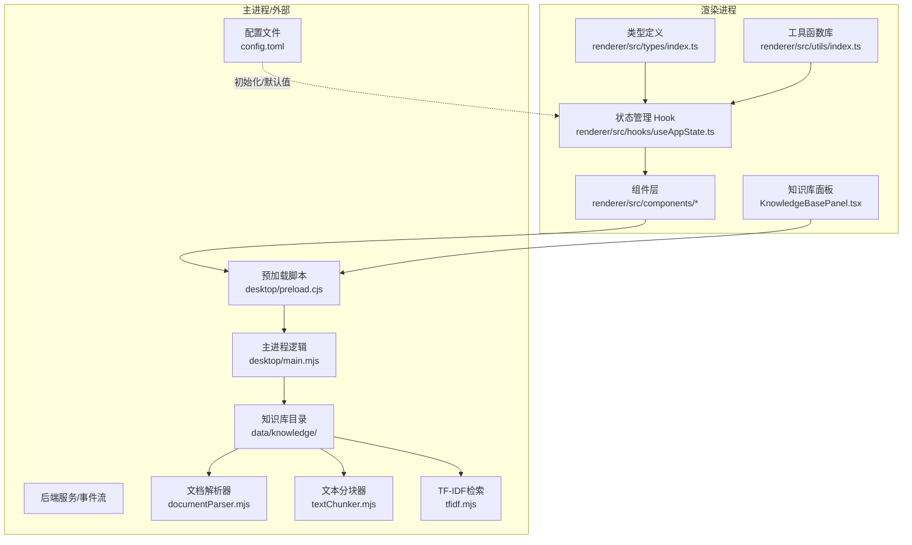
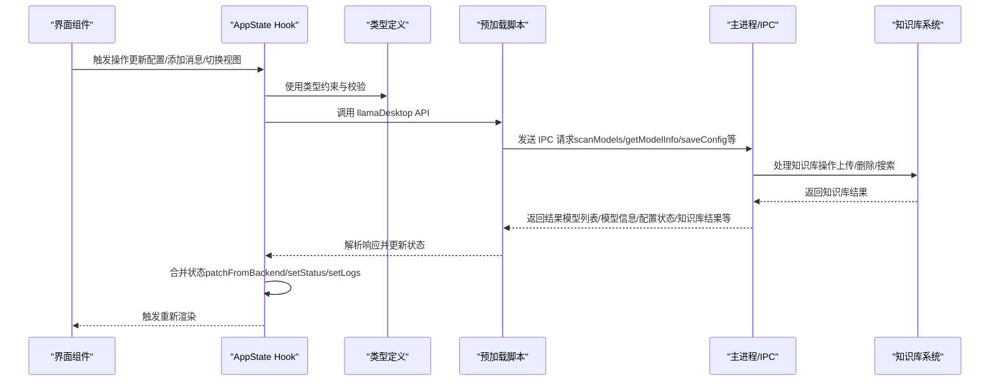
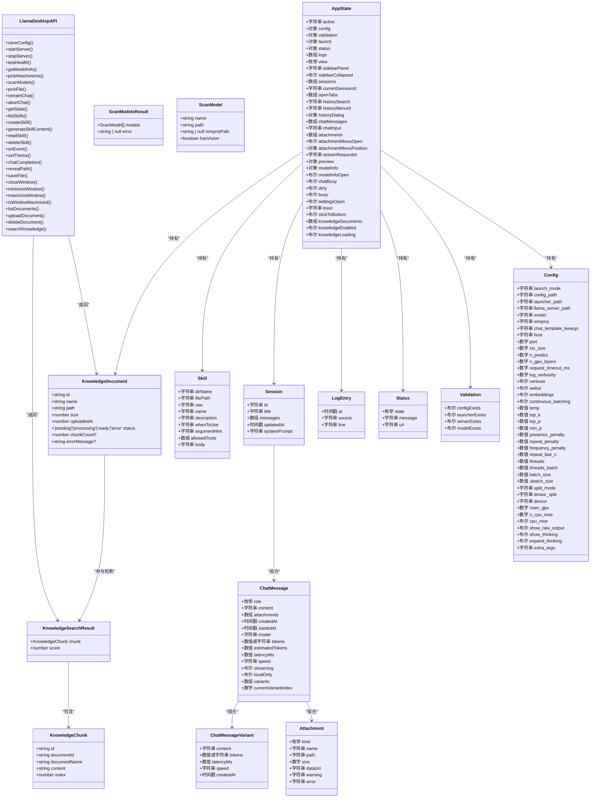
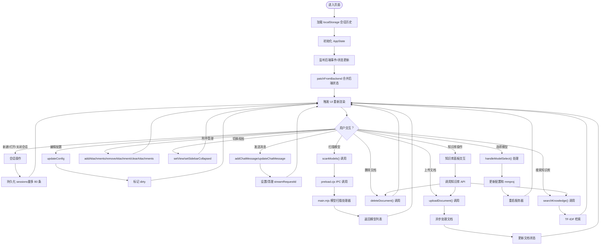
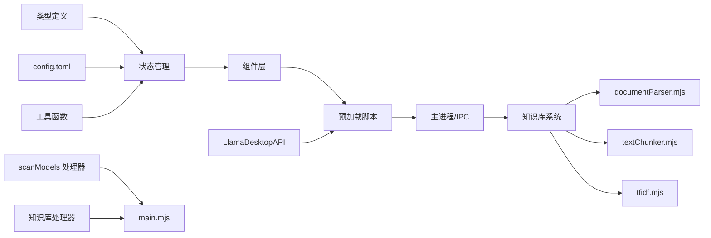

# 数据模型

<cite>
**本文引用的文件**
- [renderer/src/types/index.ts](file://renderer/src/types/index.ts)
- [renderer/src/hooks/useAppState.ts](file://renderer/src/hooks/useAppState.ts)
- [renderer/src/utils/index.ts](file://renderer/src/utils/index.ts)
- [renderer/src/components/ChatInput.tsx](file://renderer/src/components/ChatInput.tsx)
- [renderer/src/components/ModelInfoModal.tsx](file://renderer/src/components/ModelInfoModal.tsx)
- [renderer/src/components/KnowledgeBasePanel.tsx](file://renderer/src/components/KnowledgeBasePanel.tsx)
- [renderer/src/App.tsx](file://renderer/src/App.tsx)
- [desktop/main.mjs](file://desktop/main.mjs)
- [desktop/preload.cjs](file://desktop/preload.cjs)
- [desktop/utils/documentParser.mjs](file://desktop/utils/documentParser.mjs)
- [desktop/utils/textChunker.mjs](file://desktop/utils/textChunker.mjs)
- [desktop/utils/tfidf.mjs](file://desktop/utils/tfidf.mjs)
- [config.toml](file://config.toml)
- [package.json](file://package.json)
</cite>

## 目录
1. [简介](#简介)
2. [项目结构](#项目结构)
3. [核心组件](#核心组件)
4. [架构总览](#架构总览)
5. [详细组件分析](#详细组件分析)
6. [依赖分析](#依赖分析)
7. [性能考量](#性能考量)
8. [故障排查指南](#故障排查指南)
9. [结论](#结论)
10. [附录](#附录)

## 简介
本文件系统性梳理 illama-desktop 的数据模型，聚焦渲染进程中的核心类型与状态管理，覆盖以下关键实体：Config、ChatMessage、Session、Skill、Attachment、LogEntry、Status、Validation、AppState、LlamaDesktopAPI 等。**新增**知识库相关的数据模型，包括 KnowledgeDocument、KnowledgeChunk、KnowledgeSearchResult 等类型定义，以及知识库状态管理。文档从数据结构定义、字段类型与约束、实体间关系、验证与业务规则、序列化与反序列化、状态流与更新机制、演进与兼容性、最佳实践与性能优化等方面进行深入说明，并提供可视化图示帮助开发者快速理解与正确使用。

**更新** 新增知识库数据模型和相关功能，包括文档管理、文本分块、TF-IDF 检索等完整知识库解决方案。

## 项目结构
本项目采用前端 TypeScript + React + Electron 架构，数据模型主要集中在渲染进程的类型定义与状态管理 Hook 中；配置以 TOML 形式存在，用于初始化与持久化部分参数。**新增**的知识库功能通过 IPC 接口与主进程通信，实现文档上传、解析、分块、检索等完整流程。

**图表来源**
- [renderer/src/types/index.ts:195-220](file://renderer/src/types/index.ts#L195-L220)
- [renderer/src/hooks/useAppState.ts:565-578](file://renderer/src/hooks/useAppState.ts#L565-L578)
- [renderer/src/components/KnowledgeBasePanel.tsx:1-319](file://renderer/src/components/KnowledgeBasePanel.tsx#L1-L319)
- [desktop/main.mjs:2228-2443](file://desktop/main.mjs#L2228-L2443)
- [desktop/utils/documentParser.mjs:1-131](file://desktop/utils/documentParser.mjs#L1-L131)
- [desktop/utils/textChunker.mjs:1-115](file://desktop/utils/textChunker.mjs#L1-L115)
- [desktop/utils/tfidf.mjs:1-111](file://desktop/utils/tfidf.mjs#L1-L111)

**章节来源**
- [renderer/src/types/index.ts:195-220](file://renderer/src/types/index.ts#L195-L220)
- [renderer/src/hooks/useAppState.ts:565-578](file://renderer/src/hooks/useAppState.ts#L565-L578)
- [renderer/src/components/KnowledgeBasePanel.tsx:1-319](file://renderer/src/components/KnowledgeBasePanel.tsx#L1-L319)
- [desktop/main.mjs:2228-2443](file://desktop/main.mjs#L2228-L2443)
- [desktop/utils/documentParser.mjs:1-131](file://desktop/utils/documentParser.mjs#L1-L131)
- [desktop/utils/textChunker.mjs:1-115](file://desktop/utils/textChunker.mjs#L1-L115)
- [desktop/utils/tfidf.mjs:1-111](file://desktop/utils/tfidf.mjs#L1-L111)

## 核心组件
本节对关键数据模型进行逐项解析，明确字段、类型、约束与典型用途。

- **LlamaDesktopAPI（桌面应用 API 接口）**
  - **作用**：定义渲染进程与主进程通信的所有接口，包括配置管理、服务控制、模型操作、文件处理、**知识库管理**等。
  - **关键方法与类型**：
    - `scanModels()`：扫描 models 文件夹中的模型文件，返回模型列表和错误信息
    - `getModelInfo()`：获取当前模型的详细信息
    - `saveConfig()`、`startServer()`、`stopServer()`：配置管理和服务器控制
    - `streamChat()`、`abortChat()`：流式对话处理
    - `pickAttachments()`、`pickFile()`：文件选择和附件处理
    - **新增** `listDocuments()`、`uploadDocument()`、`deleteDocument()`、`searchKnowledge()`：知识库管理接口
  - **新增字段**：`listDocuments(): Promise<{ documents: KnowledgeDocument[] }>`、`uploadDocument(filePath: string): Promise<{ ok: boolean; document?: KnowledgeDocument; error?: string }>`、`deleteDocument(docId: string): Promise<{ ok: boolean; error?: string }>`、`searchKnowledge(query: string, opts?: { topK?: number }): Promise<{ results: KnowledgeSearchResult[]; error?: string }>`
  - **约束与规则**：
    - 所有方法都通过 IPC 与主进程通信，返回标准化的 Promise 结果
    - scanModels 返回的 models 数组包含模型名称、路径、投影文件路径和视觉支持标识
    - error 字段用于错误状态的统一处理
    - **新增** 知识库接口支持文档 CRUD 操作和基于 TF-IDF 的语义检索
  - **参考路径**：[renderer/src/types/index.ts:31-35](file://renderer/src/types/index.ts#L31-L35)，[desktop/preload.cjs:3-32](file://desktop/preload.cjs#L3-L32)

- **Config（配置）**
  - **作用**：承载 llama-server 与应用运行所需的全部参数，既作为启动参数传递，也作为 UI 设置项集合。
  - **关键字段与类型**（节选）：launch_mode、config_path、launcher_path、llama_server_path、model、mmproj、host、port、ctx_size、n_predict、n_gpu_layers、request_timeout_ms、log_verbosity、verbose、webui、embeddings、continuous_batching、temp、top_k、top_p、min_p、presence_penalty、repeat_penalty、frequency_penalty、repeat_last_n、threads、threads_batch、batch_size、ubatch_size、split_mode、tensor_split、device、main_gpu、n_cpu_moe、cpu_moe、show_raw_output、show_thinking、expand_thinking、extra_args 等。
  - **约束与规则**：
    - host/port 组合构成服务访问地址，需保证唯一且可绑定。
    - ctx_size、n_predict 等影响上下文与生成长度，过大可能触发"超出上下文"错误。
    - request_timeout_ms 控制请求超时，过小可能导致频繁超时。
    - show_thinking、expand_thinking 控制思考过程展示策略。
    - extra_args 允许追加命令行参数，需确保与 llama.cpp 兼容。
  - **持久化**：初始值来源于 config.toml，运行中通过 AppState.updateConfig 动态更新。
  - **参考路径**：[renderer/src/types/index.ts:55-105](file://renderer/src/types/index.ts#L55-L105)，[config.toml:1-27](file://config.toml#L1-L27)

- **ChatMessage（聊天消息）**
  - **作用**：表示一次完整的对话条目，支持多模态附件与流式生成状态。
  - **关键字段与类型**：role（'user' | 'assistant' | 'system'）、content、attachments、createdAt、startedAt、model、tokens、estimatedTokens、latencyMs、speed、streaming、localOnly、variants、currentVariantIndex。
  - **约束与规则**：
    - role 必须为受控枚举值；system 消息通常要求置于请求最前。
    - attachments 支持 image/audio/text/pdf/system/mcp/file 等类型，含路径、大小、dataUrl 等。
    - streaming 标记流式生成过程；variants 支持多候选回复及其统计指标。
    - tokens/estimatedTokens 用于计费与性能监控。
  - **参考路径**：[renderer/src/types/index.ts:153-178](file://renderer/src/types/index.ts#L153-L178)

- **Session（会话）**
  - **作用**：封装一次或多轮对话的历史记录与元信息。
  - **关键字段与类型**：id、title、messages（ChatMessage[]）、updatedAt、systemPrompt（可选）。
  - **约束与规则**：
    - id 唯一标识；title 由首条有效用户消息推导，长度与格式受控。
    - systemPrompt 为会话级系统提示词，可为空。
    - messages 与 AppState.chatMessages 同步，支持增删改。
  - **参考路径**：[renderer/src/types/index.ts:180-187](file://renderer/src/types/index.ts#L180-L187)

- **Skill（技能）**
  - **作用**：内置或自定义技能的元数据与内容载体。
  - **关键字段与类型**：dirName、filePath、raw（原始内容）、name、description、whenToUse、argumentHint、allowedTools、body。
  - **约束与规则**：
    - name/description 等为展示与检索字段；body 为技能实现内容。
    - allowedTools 限定可用工具集。
  - **参考路径**：[renderer/src/types/index.ts:129-140](file://renderer/src/types/index.ts#L129-L140)

- **Attachment（附件）**
  - **作用**：多模态输入附件的统一抽象。
  - **关键字段与类型**：kind（'image' | 'audio' | 'text' | 'pdf' | 'system' | 'mcp' | 'file'）、name、path、size、dataUrl、warning、error。
  - **约束与规则**：
    - dataUrl 用于内联图片预览；path 与 size 用于文件型附件。
    - warning/error 用于提示与错误状态。
  - **参考路径**：[renderer/src/types/index.ts:142-151](file://renderer/src/types/index.ts#L142-L151)

- **LogEntry（日志条目）**
  - **作用**：统一的日志结构，便于 UI 展示与过滤。
  - **关键字段与类型**：at（时间戳）、source（stdout/stderr/desktop/chat）、line（日志内容）。
  - **约束与规则**：
    - source 用于区分来源；line 可能被压缩或过滤。
  - **参考路径**：[renderer/src/types/index.ts:122-127](file://renderer/src/types/index.ts#L122-L127)

- **Status（服务状态）**
  - **作用**：描述 llama-server 的生命周期状态与可达性。
  - **关键字段与类型**：state（'stopped' | 'starting' | 'running' | 'stopping' | 'error'）、message、url。
  - **约束与规则**：
    - state 为受控枚举；url 与 host/port 对应。
  - **参考路径**：[renderer/src/types/index.ts:107-112](file://renderer/src/types/index.ts#L107-L112)

- **Validation（验证状态）**
  - **作用**：检查关键文件是否存在（配置、启动器、服务器、模型）。
  - **关键字段与类型**：configExists、launcherExists、serverExists、modelExists。
  - **约束与规则**：
    - 任一缺失都会导致启动失败，需在 UI 中提示修复。
  - **参考路径**：[renderer/src/types/index.ts:114-120](file://renderer/src/types/index.ts#L114-L120)

- **KnowledgeDocument（知识库文档）**
  - **作用**：表示知识库中的单个文档，包含文档的基本信息和处理状态。
  - **关键字段与类型**：id（文档 ID）、name（文件名）、path（文件路径）、size（文件大小字节）、uploadedAt（上传时间戳）、status（'pending' | 'processing' | 'ready' | 'error'）、chunkCount（分块数量，可选）、errorMessage（错误信息，可选）。
  - **约束与规则**：
    - id 唯一标识；status 字段跟踪文档处理生命周期。
    - processing 状态时会定时刷新，直到变为 ready 或 error。
    - ready 状态的文档才能参与检索。
  - **参考路径**：[renderer/src/types/index.ts:195-205](file://renderer/src/types/index.ts#L195-L205)

- **KnowledgeChunk（知识库文本块）**
  - **作用**：表示从文档中提取和分块后的文本片段，用于检索和匹配。
  - **关键字段与类型**：id（文本块 ID）、documentId（所属文档 ID）、documentName（文档名称）、content（文本内容）、index（在文档中的索引）。
  - **约束与规则**：
    - 每个文本块来自特定文档，保持原文档关联。
    - index 字段用于维护文本块的顺序。
  - **参考路径**：[renderer/src/types/index.ts:207-214](file://renderer/src/types/index.ts#L207-L214)

- **KnowledgeSearchResult（知识库搜索结果）**
  - **作用**：表示知识库检索的结果，包含匹配的文本块和相似度分数。
  - **关键字段与类型**：chunk（匹配的文本块 KnowledgeChunk）、score（相似度分数）。
  - **约束与规则**：
    - score 表示查询与文本块的相似度，数值越大越相关。
    - 结果按 score 降序排列，取前 K 个。
  - **参考路径**：[renderer/src/types/index.ts:216-220](file://renderer/src/types/index.ts#L216-L220)

- **AppState（应用全局状态）**
  - **作用**：集中管理 UI 与业务状态，驱动渲染层行为。
  - **关键字段与类型**（节选）：active、config、validation、launch、status、logs、view、sidebarPanel、sidebarCollapsed、sessions、currentSessionId、openTabs、historySearch、historyMenuId、historyDialog、chatMessages、chatInput、attachments、attachmentMenuOpen、attachmentMenuPosition、streamRequestId、preview、modelInfo、modelInfoOpen、chatBusy、dirty、busy、settingsOpen、toast、stickToBottom、**knowledgeDocuments、knowledgeEnabled、knowledgeLoading**。
  - **约束与规则**：
    - sessions 通过 localStorage 持久化，上限 80 条；currentSessionId 与 openTabs 保持一致。
    - chatBusy/streamRequestId 用于流式生成的并发控制。
    - dirty 标识配置变更但未保存。
    - **新增** knowledgeDocuments 存储知识库文档列表，knowledgeEnabled 控制知识库功能开关，knowledgeLoading 标识知识库加载状态。
  - **参考路径**：[renderer/src/types/index.ts:222-258](file://renderer/src/types/index.ts#L222-L258)

**章节来源**
- [renderer/src/types/index.ts:31-35](file://renderer/src/types/index.ts#L31-L35)
- [renderer/src/types/index.ts:55-105](file://renderer/src/types/index.ts#L55-L105)
- [renderer/src/types/index.ts:107-112](file://renderer/src/types/index.ts#L107-L112)
- [renderer/src/types/index.ts:114-120](file://renderer/src/types/index.ts#L114-L120)
- [renderer/src/types/index.ts:122-127](file://renderer/src/types/index.ts#L122-L127)
- [renderer/src/types/index.ts:129-140](file://renderer/src/types/index.ts#L129-L140)
- [renderer/src/types/index.ts:142-151](file://renderer/src/types/index.ts#L142-L151)
- [renderer/src/types/index.ts:153-178](file://renderer/src/types/index.ts#L153-L178)
- [renderer/src/types/index.ts:180-187](file://renderer/src/types/index.ts#L180-L187)
- [renderer/src/types/index.ts:189-221](file://renderer/src/types/index.ts#L189-L221)
- [renderer/src/types/index.ts:195-205](file://renderer/src/types/index.ts#L195-L205)
- [renderer/src/types/index.ts:207-214](file://renderer/src/types/index.ts#L207-L214)
- [renderer/src/types/index.ts:216-220](file://renderer/src/types/index.ts#L216-L220)
- [renderer/src/types/index.ts:222-258](file://renderer/src/types/index.ts#L222-L258)

## 架构总览
渲染进程通过类型定义与状态 Hook 组织数据模型，与主进程通过 IPC 接口交互，实现配置保存、服务启停、模型信息查询、技能管理、日志与事件推送、**知识库管理**等功能。**新增**的知识库功能通过专门的 IPC 处理器实现，支持文档上传、解析、分块、检索等完整流程。

**图表来源**
- [renderer/src/types/index.ts:31-35](file://renderer/src/types/index.ts#L31-L35)
- [renderer/src/hooks/useAppState.ts:96-102](file://renderer/src/hooks/useAppState.ts#L96-L102)
- [desktop/preload.cjs:3-32](file://desktop/preload.cjs#L3-L32)
- [desktop/main.mjs:2265-2443](file://desktop/main.mjs#L2265-L2443)

**章节来源**
- [renderer/src/types/index.ts:31-35](file://renderer/src/types/index.ts#L31-L35)
- [renderer/src/hooks/useAppState.ts:96-102](file://renderer/src/hooks/useAppState.ts#L96-L102)
- [desktop/preload.cjs:3-32](file://desktop/preload.cjs#L3-L32)
- [desktop/main.mjs:2265-2443](file://desktop/main.mjs#L2265-L2443)

## 详细组件分析

### 类型关系与依赖
以下类图展示了核心数据模型之间的组合与依赖关系，包括**新增**的知识库相关类型。

**图表来源**
- [renderer/src/types/index.ts:31-35](file://renderer/src/types/index.ts#L31-L35)
- [renderer/src/types/index.ts:122-127](file://renderer/src/types/index.ts#L122-L127)
- [renderer/src/types/index.ts:129-140](file://renderer/src/types/index.ts#L129-L140)
- [renderer/src/types/index.ts:142-151](file://renderer/src/types/index.ts#L142-L151)
- [renderer/src/types/index.ts:153-178](file://renderer/src/types/index.ts#L153-L178)
- [renderer/src/types/index.ts:180-187](file://renderer/src/types/index.ts#L180-L187)
- [renderer/src/types/index.ts:189-221](file://renderer/src/types/index.ts#L189-L221)
- [renderer/src/types/index.ts:195-205](file://renderer/src/types/index.ts#L195-L205)
- [renderer/src/types/index.ts:207-214](file://renderer/src/types/index.ts#L207-L214)
- [renderer/src/types/index.ts:216-220](file://renderer/src/types/index.ts#L216-L220)

**章节来源**
- [renderer/src/types/index.ts:31-35](file://renderer/src/types/index.ts#L31-L35)
- [renderer/src/types/index.ts:107-112](file://renderer/src/types/index.ts#L107-L112)
- [renderer/src/types/index.ts:114-120](file://renderer/src/types/index.ts#L114-L120)
- [renderer/src/types/index.ts:122-127](file://renderer/src/types/index.ts#L122-L127)
- [renderer/src/types/index.ts:129-140](file://renderer/src/types/index.ts#L129-L140)
- [renderer/src/types/index.ts:142-151](file://renderer/src/types/index.ts#L142-L151)
- [renderer/src/types/index.ts:153-178](file://renderer/src/types/index.ts#L153-L178)
- [renderer/src/types/index.ts:180-187](file://renderer/src/types/index.ts#L180-L187)
- [renderer/src/types/index.ts:189-221](file://renderer/src/types/index.ts#L189-L221)
- [renderer/src/types/index.ts:195-205](file://renderer/src/types/index.ts#L195-L205)
- [renderer/src/types/index.ts:207-214](file://renderer/src/types/index.ts#L207-L214)
- [renderer/src/types/index.ts:216-220](file://renderer/src/types/index.ts#L216-L220)

### 状态管理与数据流
AppState Hook 负责应用状态的集中管理与更新，包含以下关键流程：

- **初始化与持久化**
  - 从 localStorage 加载 sessions 并生成初始 currentSessionId/openTabs。
  - **参考路径**：[renderer/src/hooks/useAppState.ts:69-79](file://renderer/src/hooks/useAppState.ts#L69-L79)，[renderer/src/hooks/useAppState.ts:42-55](file://renderer/src/hooks/useAppState.ts#L42-L55)，[renderer/src/hooks/useAppState.ts:57-66](file://renderer/src/hooks/useAppState.ts#L57-L66)

- **会话生命周期**
  - 新建/打开/关闭/删除会话；自动保存当前会话；维护 openTabs 与 currentSessionId。
  - **参考路径**：[renderer/src/hooks/useAppState.ts:269-303](file://renderer/src/hooks/useAppState.ts#L269-L303)，[renderer/src/hooks/useAppState.ts:211-266](file://renderer/src/hooks/useAppState.ts#L211-L266)，[renderer/src/hooks/useAppState.ts:138-208](file://renderer/src/hooks/useAppState.ts#L138-L208)，[renderer/src/hooks/useAppState.ts:317-339](file://renderer/src/hooks/useAppState.ts#L317-L339)

- **消息与附件**
  - 添加/更新/移除消息；批量管理附件；流式请求 ID 管理。
  - **参考路径**：[renderer/src/hooks/useAppState.ts:395-424](file://renderer/src/hooks/useAppState.ts#L395-L424)，[renderer/src/hooks/useAppState.ts:378-393](file://renderer/src/hooks/useAppState.ts#L378-L393)，[renderer/src/hooks/useAppState.ts:431-434](file://renderer/src/hooks/useAppState.ts#L431-L434)

- **后端状态同步**
  - patchFromBackend 合并后端返回的 config/validation/status/logs/launch。
  - **参考路径**：[renderer/src/hooks/useAppState.ts:96-102](file://renderer/src/hooks/useAppState.ts#L96-L102)

- **UI 状态与视图**
  - 切换视图、侧边栏、设置面板、模型信息面板、粘性滚动等。
  - **参考路径**：[renderer/src/hooks/useAppState.ts:437-449](file://renderer/src/hooks/useAppState.ts#L437-L449)，[renderer/src/hooks/useAppState.ts:451-454](file://renderer/src/hooks/useAppState.ts#L451-L454)，[renderer/src/hooks/useAppState.ts:476-483](file://renderer/src/hooks/useAppState.ts#L476-L483)，[renderer/src/hooks/useAppState.ts:538-540](file://renderer/src/hooks/useAppState.ts#L538-L540)

- **模型扫描流程**
  - 用户点击模型选择按钮触发 scanModels 调用
  - 预加载脚本通过 IPC 调用主进程的模型扫描处理器
  - 主进程扫描 models 文件夹并返回匹配的模型列表
  - 渲染进程更新模型菜单并支持自动匹配 mmproj 文件
  - **参考路径**：[renderer/src/components/ChatInput.tsx:107-165](file://renderer/src/components/ChatInput.tsx#L107-L165)，[desktop/preload.cjs:16](file://desktop/preload.cjs#L16)，[desktop/main.mjs:2165-2225](file://desktop/main.mjs#L2165-L2225)

- **知识库状态管理流程**
  - AppState 中新增 knowledgeDocuments、knowledgeEnabled、knowledgeLoading 字段
  - setKnowledgeDocuments/setKnowledgeEnabled/setKnowledgeLoading 方法用于更新知识库状态
  - 知识库面板组件通过 window.llamaDesktop API 调用知识库功能
  - 文档上传后异步处理，状态从 processing 变为 ready 或 error
  - **参考路径**：[renderer/src/hooks/useAppState.ts:565-578](file://renderer/src/hooks/useAppState.ts#L565-L578)，[renderer/src/components/KnowledgeBasePanel.tsx:16-30](file://renderer/src/components/KnowledgeBasePanel.tsx#L16-L30)，[desktop/main.mjs:2265-2443](file://desktop/main.mjs#L2265-L2443)

**图表来源**
- [renderer/src/hooks/useAppState.ts:69-79](file://renderer/src/hooks/useAppState.ts#L69-L79)
- [renderer/src/hooks/useAppState.ts:96-102](file://renderer/src/hooks/useAppState.ts#L96-L102)
- [renderer/src/hooks/useAppState.ts:364-370](file://renderer/src/hooks/useAppState.ts#L364-L370)
- [renderer/src/hooks/useAppState.ts:395-424](file://renderer/src/hooks/useAppState.ts#L395-L424)
- [renderer/src/hooks/useAppState.ts:378-393](file://renderer/src/hooks/useAppState.ts#L378-L393)
- [renderer/src/hooks/useAppState.ts:437-454](file://renderer/src/hooks/useAppState.ts#L437-L454)
- [renderer/src/hooks/useAppState.ts:431-434](file://renderer/src/hooks/useAppState.ts#L431-L434)
- [renderer/src/hooks/useAppState.ts:565-578](file://renderer/src/hooks/useAppState.ts#L565-L578)
- [renderer/src/components/ChatInput.tsx:107-165](file://renderer/src/components/ChatInput.tsx#L107-L165)
- [renderer/src/components/KnowledgeBasePanel.tsx:16-30](file://renderer/src/components/KnowledgeBasePanel.tsx#L16-L30)
- [desktop/preload.cjs:16](file://desktop/preload.cjs#L16)
- [desktop/main.mjs:2265-2443](file://desktop/main.mjs#L2265-L2443)

**章节来源**
- [renderer/src/hooks/useAppState.ts:69-79](file://renderer/src/hooks/useAppState.ts#L69-L79)
- [renderer/src/hooks/useAppState.ts:96-102](file://renderer/src/hooks/useAppState.ts#L96-L102)
- [renderer/src/hooks/useAppState.ts:364-370](file://renderer/src/hooks/useAppState.ts#L364-L370)
- [renderer/src/hooks/useAppState.ts:395-424](file://renderer/src/hooks/useAppState.ts#L395-L424)
- [renderer/src/hooks/useAppState.ts:378-393](file://renderer/src/hooks/useAppState.ts#L378-L393)
- [renderer/src/hooks/useAppState.ts:431-434](file://renderer/src/hooks/useAppState.ts#L431-L434)
- [renderer/src/hooks/useAppState.ts:437-454](file://renderer/src/hooks/useAppState.ts#L437-L454)
- [renderer/src/hooks/useAppState.ts:565-578](file://renderer/src/hooks/useAppState.ts#L565-L578)
- [renderer/src/components/ChatInput.tsx:107-165](file://renderer/src/components/ChatInput.tsx#L107-L165)
- [renderer/src/components/KnowledgeBasePanel.tsx:16-30](file://renderer/src/components/KnowledgeBasePanel.tsx#L16-L30)
- [desktop/preload.cjs:16](file://desktop/preload.cjs#L16)
- [desktop/main.mjs:2265-2443](file://desktop/main.mjs#L2265-L2443)

### 数据验证与业务规则
- **配置校验**
  - 通过 Validation 结构检查关键文件存在性；若缺失，UI 应提示修复。
  - **参考路径**：[renderer/src/types/index.ts:114-120](file://renderer/src/types/index.ts#L114-L120)

- **消息角色与顺序**
  - system 消息必须位于请求最前；错误消息包含特定关键字时需友好提示。
  - **参考路径**：[renderer/src/utils/index.ts:50-66](file://renderer/src/utils/index.ts#L50-L66)

- **上下文与生成长度**
  - ctx_size 与 n_predict 过大可能触发"超出上下文"错误；可通过增大 ctx_size 或减少附件缓解。
  - **参考路径**：[renderer/src/utils/index.ts:62-63](file://renderer/src/utils/index.ts#L62-L63)

- **日志过滤与压缩**
  - visibleLogs/compactLogLineForDisplay/visibleTerminalLogs 用于提升可读性与性能。
  - **参考路径**：[renderer/src/utils/index.ts:110-165](file://renderer/src/utils/index.ts#L110-L165)

- **模型扫描验证规则**
  - models 文件夹不存在时返回错误信息
  - 自动匹配主模型和 mmproj 文件，支持视觉功能检测
  - 量化级别和参数规模从文件名解析
  - **参考路径**：[desktop/main.mjs:2165-2225](file://desktop/main.mjs#L2165-L2225)

- **知识库文档验证规则**
  - 支持的文件格式：.pdf、.doc、.docx、.xls、.xlsx、.txt、.md
  - 文档状态转换：pending → processing → ready/error
  - 检索限制：仅搜索状态为 ready 的文档
  - 分块参数：chunkSize=500，overlap=50，maxChunks=100
  - **参考路径**：[desktop/main.mjs:2286-2290](file://desktop/main.mjs#L2286-L2290)，[desktop/main.mjs:2423-2427](file://desktop/main.mjs#L2423-L2427)，[desktop/utils/textChunker.mjs:14-19](file://desktop/utils/textChunker.mjs#L14-L19)

**章节来源**
- [renderer/src/types/index.ts:114-120](file://renderer/src/types/index.ts#L114-L120)
- [renderer/src/utils/index.ts:50-66](file://renderer/src/utils/index.ts#L50-L66)
- [renderer/src/utils/index.ts:62-63](file://renderer/src/utils/index.ts#L62-L63)
- [renderer/src/utils/index.ts:110-165](file://renderer/src/utils/index.ts#L110-L165)
- [desktop/main.mjs:2165-2225](file://desktop/main.mjs#L2165-L2225)
- [desktop/main.mjs:2286-2290](file://desktop/main.mjs#L2286-L2290)
- [desktop/main.mjs:2423-2427](file://desktop/main.mjs#L2423-L2427)
- [desktop/utils/textChunker.mjs:14-19](file://desktop/utils/textChunker.mjs#L14-L19)

### 序列化与反序列化
- **会话持久化**
  - sessions 通过 JSON 序列化写入 localStorage，上限 80 条；加载时进行数组校验与异常兜底。
  - **参考路径**：[renderer/src/hooks/useAppState.ts:42-55](file://renderer/src/hooks/useAppState.ts#L42-L55)，[renderer/src/hooks/useAppState.ts:52-55](file://renderer/src/hooks/useAppState.ts#L52-L55)

- **配置与状态**
  - Config 与 AppState 在运行中以对象形式传递；与主进程交互时通过 IPC 序列化为 JSON。
  - **参考路径**：[renderer/src/types/index.ts:55-105](file://renderer/src/types/index.ts#L55-L105)，[renderer/src/types/index.ts:222-258](file://renderer/src/types/index.ts#L222-L258)

- **模型扫描结果序列化**
  - scanModels 返回的对象包含 models 数组和 error 字段，通过 IPC 序列化传输
  - models 数组中的每个元素包含 name、path、mmprojPath、hasVision 字段
  - **参考路径**：[renderer/src/types/index.ts:16](file://renderer/src/types/index.ts#L16)，[desktop/main.mjs:2208-2217](file://desktop/main.mjs#L2208-L2217)

- **知识库数据序列化**
  - 知识库索引文件 index.json 包含 documents、chunks、lastUpdated 字段
  - KnowledgeDocument 序列化包含所有字段，支持可选字段
  - KnowledgeChunk 序列化包含完整文本块信息
  - **参考路径**：[desktop/main.mjs:2247-2254](file://desktop/main.mjs#L2247-L2254)，[renderer/src/types/index.ts:195-214](file://renderer/src/types/index.ts#L195-L214)

**章节来源**
- [renderer/src/hooks/useAppState.ts:42-55](file://renderer/src/hooks/useAppState.ts#L42-L55)
- [renderer/src/hooks/useAppState.ts:52-55](file://renderer/src/hooks/useAppState.ts#L52-L55)
- [renderer/src/types/index.ts:55-105](file://renderer/src/types/index.ts#L55-L105)
- [renderer/src/types/index.ts:16](file://renderer/src/types/index.ts#L16)
- [renderer/src/types/index.ts:195-214](file://renderer/src/types/index.ts#L195-L214)
- [desktop/main.mjs:2208-2217](file://desktop/main.mjs#L2208-L2217)
- [desktop/main.mjs:2247-2254](file://desktop/main.mjs#L2247-L2254)

### 演进历史与版本兼容性
- **版本号**
  - 项目版本号遵循形如 v1.0.yyyy.mm.dd 的格式，便于追踪构建日期与功能迭代。
  - **参考路径**：[package.json:1-51](file://package.json#L1-L51)

- **配置兼容性**
  - config.toml 中新增参数需在类型定义中同步扩展；旧版参数变更需向后兼容或提供迁移提示。
  - **参考路径**：[config.toml:1-27](file://config.toml#L1-L27)，[renderer/src/types/index.ts:55-105](file://renderer/src/types/index.ts#L55-L105)

- **类型演进**
  - ChatMessage.variants/currentVariantIndex 为新引入的多候选回复能力；需在 UI 与后端共同演进。
  - **参考路径**：[renderer/src/types/index.ts:171-178](file://renderer/src/types/index.ts#L171-L178)

- **新增功能演进**
  - scanModels API 为新增的模型扫描功能，提供自动模型检测和匹配能力
  - 与现有 Config 和 Attachment 类型无缝集成
  - **参考路径**：[renderer/src/types/index.ts:16](file://renderer/src/types/index.ts#L16)，[desktop/main.mjs:2165-2225](file://desktop/main.mjs#L2165-L2225)

- **知识库功能演进**
  - 新增 KnowledgeDocument、KnowledgeChunk、KnowledgeSearchResult 类型定义
  - 新增 listDocuments、uploadDocument、deleteDocument、searchKnowledge API
  - 新增知识库状态管理字段和操作方法
  - **参考路径**：[renderer/src/types/index.ts:195-220](file://renderer/src/types/index.ts#L195-L220)，[renderer/src/hooks/useAppState.ts:565-578](file://renderer/src/hooks/useAppState.ts#L565-L578)，[desktop/main.mjs:2265-2443](file://desktop/main.mjs#L2265-L2443)

**章节来源**
- [package.json:1-51](file://package.json#L1-L51)
- [config.toml:1-27](file://config.toml#L1-L27)
- [renderer/src/types/index.ts:55-105](file://renderer/src/types/index.ts#L55-L105)
- [renderer/src/types/index.ts:16](file://renderer/src/types/index.ts#L16)
- [renderer/src/types/index.ts:171-178](file://renderer/src/types/index.ts#L171-L178)
- [renderer/src/types/index.ts:195-220](file://renderer/src/types/index.ts#L195-L220)
- [renderer/src/hooks/useAppState.ts:565-578](file://renderer/src/hooks/useAppState.ts#L565-L578)
- [desktop/main.mjs:2165-2225](file://desktop/main.mjs#L2165-L2225)
- [desktop/main.mjs:2265-2443](file://desktop/main.mjs#L2265-L2443)

## 依赖分析
- **组件耦合**
  - AppState 对 Config/Validation/Status/LogEntry/Skill/Session/ChatMessage、**KnowledgeDocument** 等具有强依赖；各模块职责清晰，耦合度适中。
  - 新增的 LlamaDesktopAPI 为渲染进程与主进程通信的统一入口，**包含知识库相关方法**。
- **外部依赖**
  - 通过 IPC 接口与主进程交互；日志与事件由后端推送至前端。
  - 预加载脚本负责暴露 API 到渲染进程环境。
  - **新增** 知识库功能依赖 documentParser、textChunker、tfidf 等工具模块。
- **潜在循环依赖**
  - 类型定义与状态管理相互独立，无循环依赖风险。

**图表来源**
- [renderer/src/types/index.ts:195-220](file://renderer/src/types/index.ts#L195-L220)
- [renderer/src/hooks/useAppState.ts:1-582](file://renderer/src/hooks/useAppState.ts#L1-L582)
- [renderer/src/utils/index.ts:1-165](file://renderer/src/utils/index.ts#L1-L165)
- [renderer/src/components/ChatInput.tsx:107-165](file://renderer/src/components/ChatInput.tsx#L107-L165)
- [renderer/src/components/KnowledgeBasePanel.tsx:1-319](file://renderer/src/components/KnowledgeBasePanel.tsx#L1-L319)
- [desktop/preload.cjs:1-33](file://desktop/preload.cjs#L1-L33)
- [desktop/main.mjs:2228-2443](file://desktop/main.mjs#L2228-L2443)
- [desktop/utils/documentParser.mjs:1-131](file://desktop/utils/documentParser.mjs#L1-L131)
- [desktop/utils/textChunker.mjs:1-115](file://desktop/utils/textChunker.mjs#L1-L115)
- [desktop/utils/tfidf.mjs:1-111](file://desktop/utils/tfidf.mjs#L1-L111)
- [config.toml:1-27](file://config.toml#L1-L27)

**章节来源**
- [renderer/src/types/index.ts:195-220](file://renderer/src/types/index.ts#L195-L220)
- [renderer/src/hooks/useAppState.ts:1-582](file://renderer/src/hooks/useAppState.ts#L1-L582)
- [renderer/src/utils/index.ts:1-165](file://renderer/src/utils/index.ts#L1-L165)
- [renderer/src/components/ChatInput.tsx:107-165](file://renderer/src/components/ChatInput.tsx#L107-L165)
- [renderer/src/components/KnowledgeBasePanel.tsx:1-319](file://renderer/src/components/KnowledgeBasePanel.tsx#L1-L319)
- [desktop/preload.cjs:1-33](file://desktop/preload.cjs#L1-L33)
- [desktop/main.mjs:2228-2443](file://desktop/main.mjs#L2228-L2443)
- [desktop/utils/documentParser.mjs:1-131](file://desktop/utils/documentParser.mjs#L1-L131)
- [desktop/utils/textChunker.mjs:1-115](file://desktop/utils/textChunker.mjs#L1-L115)
- [desktop/utils/tfidf.mjs:1-111](file://desktop/utils/tfidf.mjs#L1-L111)
- [config.toml:1-27](file://config.toml#L1-L27)

## 性能考量
- **会话持久化上限**
  - sessions 最多保留 80 条，避免 localStorage 过载；建议定期清理。
  - **参考路径**：[renderer/src/hooks/useAppState.ts:52-55](file://renderer/src/hooks/useAppState.ts#L52-L55)

- **日志过滤与压缩**
  - visibleLogs/compactLogLineForDisplay/visibleTerminalLogs 减少 DOM 渲染压力与内存占用。
  - **参考路径**：[renderer/src/utils/index.ts:110-165](file://renderer/src/utils/index.ts#L110-L165)

- **Token 估算**
  - estimateTokens 用于预估消耗，辅助 UI 提示与资源规划。
  - **参考路径**：[renderer/src/utils/index.ts:20-34](file://renderer/src/utils/index.ts#L20-L34)

- **流式生成**
  - streamRequestId 与 chatBusy 协同控制并发与 UI 状态，避免重复请求与闪烁。
  - **参考路径**：[renderer/src/hooks/useAppState.ts:427-434](file://renderer/src/hooks/useAppState.ts#L427-L434)，[renderer/src/hooks/useAppState.ts:426-429](file://renderer/src/hooks/useAppState.ts#L426-L429)

- **模型扫描性能优化**
  - 异步扫描 models 文件夹，避免阻塞 UI 线程
  - 使用 Map 数据结构进行 mmproj 文件匹配，提高查找效率
  - 文件过滤和正则表达式匹配优化
  - **参考路径**：[desktop/main.mjs:2165-2225](file://desktop/main.mjs#L2165-L2225)

- **知识库性能优化**
  - 文档异步处理，避免阻塞 UI 线程
  - 使用 Map 数据结构存储 ready 文档 ID，提高检索效率
  - TF-IDF 检索算法优化，仅对 ready 状态文档进行检索
  - 文本分块参数调优：chunkSize=500，overlap=50，maxChunks=100
  - **参考路径**：[desktop/main.mjs:2315-2375](file://desktop/main.mjs#L2315-L2375)，[desktop/main.mjs:2423-2427](file://desktop/main.mjs#L2423-L2427)，[desktop/utils/textChunker.mjs:14-19](file://desktop/utils/textChunker.mjs#L14-L19)

**章节来源**
- [renderer/src/hooks/useAppState.ts:52-55](file://renderer/src/hooks/useAppState.ts#L52-L55)
- [renderer/src/utils/index.ts:110-165](file://renderer/src/utils/index.ts#L110-L165)
- [renderer/src/utils/index.ts:20-34](file://renderer/src/utils/index.ts#L20-L34)
- [renderer/src/hooks/useAppState.ts:426-434](file://renderer/src/hooks/useAppState.ts#L426-L434)
- [desktop/main.mjs:2165-2225](file://desktop/main.mjs#L2165-L2225)
- [desktop/main.mjs:2315-2375](file://desktop/main.mjs#L2315-L2375)
- [desktop/main.mjs:2423-2427](file://desktop/main.mjs#L2423-L2427)
- [desktop/utils/textChunker.mjs:14-19](file://desktop/utils/textChunker.mjs#L14-L19)

## 故障排查指南
- **常见错误与提示**
  - "系统消息必须位于最前"：自动整理历史消息后重试。
  - "请求超时"：增大 request_timeout_ms 或降低 ctx_size/n_predict。
  - "Chat Template Kwargs 不是合法 JSON"：修正为有效 JSON。
  - "超出上下文"：增大 ctx_size 或减少附件大小。
  - **参考路径**：[renderer/src/utils/index.ts:50-66](file://renderer/src/utils/index.ts#L50-L66)

- **日志可观测性**
  - 使用 visibleLogs/visibleTerminalLogs 过滤噪声；关注 server is listening/model loaded 等关键行。
  - **参考路径**：[renderer/src/utils/index.ts:110-165](file://renderer/src/utils/index.ts#L110-L165)

- **状态诊断**
  - 通过 Status.state 与 Status.message 快速定位服务状态；必要时重试启动或检查 host/port。
  - **参考路径**：[renderer/src/types/index.ts:107-112](file://renderer/src/types/index.ts#L107-L112)

- **模型扫描故障排查**
  - "未找到 models 文件夹"：检查项目根目录下是否存在 models 文件夹
  - "扫描失败"：查看错误信息中的具体原因，检查文件权限和磁盘空间
  - 模型文件未正确匹配：确认 .gguf 文件命名规范，检查 mmproj 文件命名
  - **参考路径**：[desktop/main.mjs:2220-2225](file://desktop/main.mjs#L2220-L2225)，[desktop/main.mjs:2219-2223](file://desktop/main.mjs#L2219-L2223)

- **知识库故障排查**
  - "文件不存在"：检查文件路径是否正确，文件是否被其他程序占用
  - "不支持的文件格式"：确认文件扩展名在支持列表中 [.pdf, .doc, .docx, .xls, .xlsx, .txt, .md]
  - "文档内容为空"：检查文档是否包含可提取文本内容
  - "无法分块"：检查文本内容长度，调整分块参数
  - "没有可用的文档"：确认至少有一个状态为 ready 的文档
  - **参考路径**：[desktop/main.mjs:2279-2280](file://desktop/main.mjs#L2279-L2280)，[desktop/main.mjs:2286-2290](file://desktop/main.mjs#L2286-L2290)，[desktop/main.mjs:2329-2331](file://desktop/main.mjs#L2329-L2331)，[desktop/main.mjs:2341-2343](file://desktop/main.mjs#L2341-L2343)，[desktop/main.mjs:2429-2431](file://desktop/main.mjs#L2429-L2431)

**章节来源**
- [renderer/src/utils/index.ts:50-66](file://renderer/src/utils/index.ts#L50-L66)
- [renderer/src/utils/index.ts:110-165](file://renderer/src/utils/index.ts#L110-L165)
- [renderer/src/types/index.ts:107-112](file://renderer/src/types/index.ts#L107-L112)
- [desktop/main.mjs:2220-2225](file://desktop/main.mjs#L2220-L2225)
- [desktop/main.mjs:2219-2223](file://desktop/main.mjs#L2219-L2223)
- [desktop/main.mjs:2279-2280](file://desktop/main.mjs#L2279-L2280)
- [desktop/main.mjs:2286-2290](file://desktop/main.mjs#L2286-L2290)
- [desktop/main.mjs:2329-2331](file://desktop/main.mjs#L2329-L2331)
- [desktop/main.mjs:2341-2343](file://desktop/main.mjs#L2341-L2343)
- [desktop/main.mjs:2429-2431](file://desktop/main.mjs#L2429-L2431)

## 结论
illama-desktop 的数据模型以类型安全为核心，结合 AppState Hook 实现了高内聚、低耦合的状态管理。通过明确的字段约束、严格的验证规则与完善的日志过滤机制，系统在易用性与稳定性之间取得平衡。**新增**的知识库功能进一步增强了应用的实用性，提供了完整的文档管理、文本解析、分块和检索能力。通过 TF-IDF 检索算法和异步处理机制，知识库功能在性能和用户体验方面都得到了优化。建议在后续版本中持续完善类型定义与后端协议的一致性，强化配置迁移与向后兼容策略，同时优化模型扫描和知识库处理的性能和准确性。

## 附录
- **最佳实践**
  - 使用类型定义约束所有输入输出，避免运行期类型错误。
  - 对外暴露的 IPC 接口应严格校验 payload 结构与字段范围。
  - 会话与配置变更需及时持久化并设置 dirty 标识，便于用户感知。
  - 对于大文本与附件，优先采用流式处理与懒加载策略。
  - 模型扫描功能应定期执行，确保模型文件的最新状态。
  - **新增** 知识库文档上传后应等待 processing 状态完成再进行检索。
  - **新增** 检索时合理设置 topK 参数，平衡召回率和性能。
- **性能优化建议**
  - 控制 sessions 与 logs 的容量，定期清理。
  - 合理使用 token 估算与上下文裁剪，避免越界。
  - 在 UI 层对高频更新进行节流/防抖，减少重渲染。
  - 优化模型扫描算法，使用缓存机制避免重复扫描。
  - 对于大型模型文件，考虑异步加载和进度提示。
  - **新增** 知识库文档异步处理，避免阻塞 UI 线程。
  - **新增** 使用索引优化检索性能，仅对 ready 状态文档进行检索。
  - **新增** 文本分块参数根据文档类型和长度进行调优。